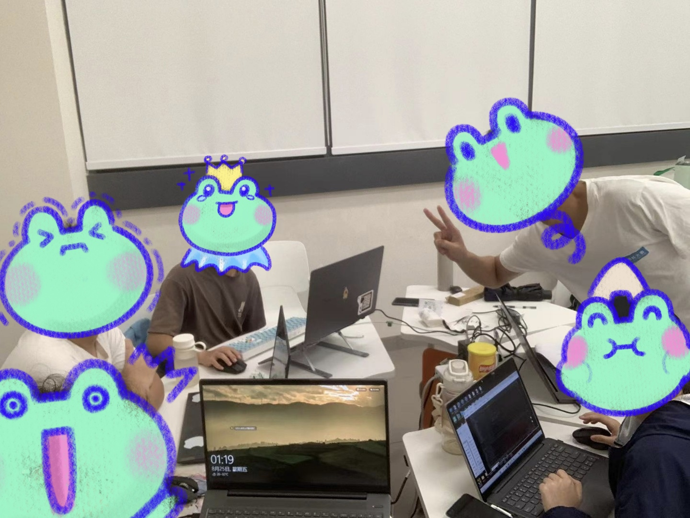
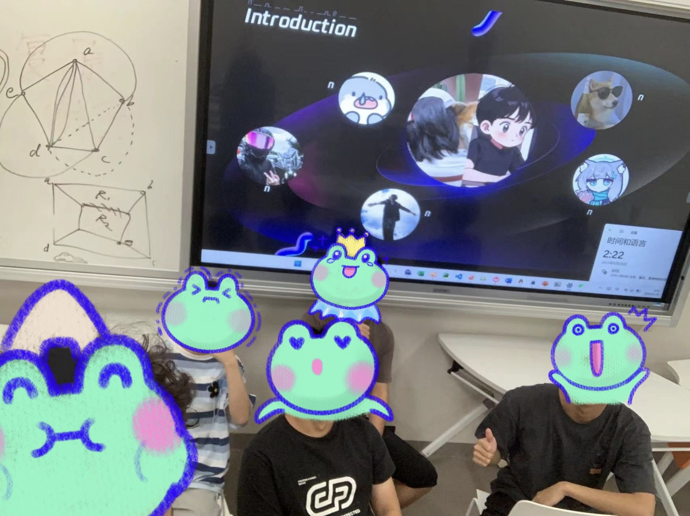
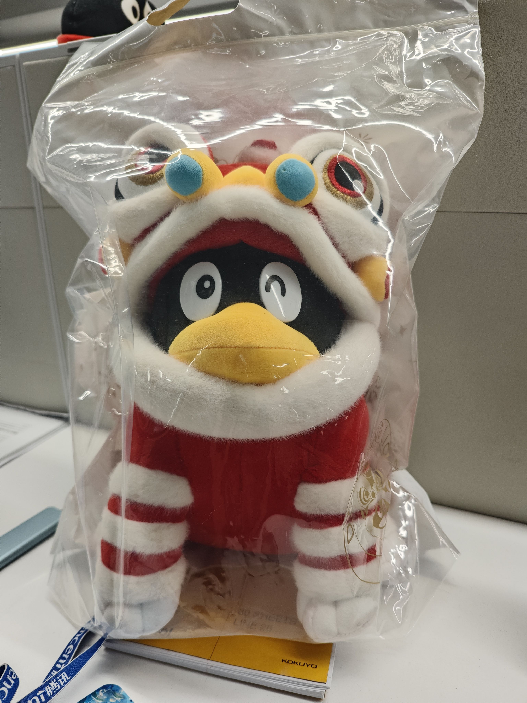

# 2023年终总结: 新观点、新方法、新认知、新朋友

## GPT省流

- 这篇文章是我对2023年的总结。我在文章中提到了我在这一年中的新认知、新观点、新方法和新朋友。

- 在新认知方面，我提到了人工智能生成模型（如GPT）的发展，以及相关的应用和技术。我介绍了ChatGPT在各个领域任务中展现出的强大知识水平，以及基于大模型的Prompt Engineering技术和微调技术的进展。此外，我还提到了大参数量模型的推理技术和私有化部署方案的改进。

- 在新观点方面，我分享了自己在编程生涯中的体会。我强调了边学边做对于快速促进技术成长的重要性，以及使用人工智能工具（如GPT和Copilot）来辅助学习和编码的方法。

- 在新方法方面，我介绍了我养成的一些学习和解决问题的方法。我强调了使用人工智能工具进行学习的重要性，同时也提到了搜文档、搜仓库和搜issue的习惯对于快速上手和解决问题的帮助。

- 在新朋友方面，我分享了在2023年认识的新朋友们。我加入了一个小团队，在项目中体验到了团队协作的魅力，并与团队成员共同努力、共同成长。此外，我还认识了实习期间的同事和导师，他们给予了我很多指导和帮助，并一起度过了愉快的时光。

- 最后，我总结了2023年给我带来的跨越和收获，并表达了对未来的期望和热爱。我希望在新的一年里能够不断学习进步，保持对代码和技术的热情，并迎接新的挑战和机遇。

## 前言

第一次写年终总结，有点紧张。

我的2023，如果用一个词来形容的话，可以说是**跨越**。先是GPT浪潮下带来的思维认知的变迁和跨越，然后是我在技术能力和学习能力上的成长和跨越，最后是开始实习的从学生到社畜的角色跨越。在这些跨越的过程中，我拓宽了新认知，总结了新观点，沉淀了新方法，收获了新朋友。

## 新认知

- 在今年，AIGC成为了一个炙手可热的一个话题，22年末，OpenAI发布的基于gpt3.5和gpt4的对话模型ChatGPT震惊全世界，基于暴力的参数堆叠加上人类反馈强化，产生的涌现能力使得在各个领域任务中都有强大的知识水平，作为大学生的我体会深刻。当它把我算法OJ上写的单纯形法给改对后，我失眠了。

- 在大模型应用上，ChatGPT的出现使得*Prompt Engineering*技术诞生，通过*CoT*，*CoV*等技巧性地编写提示词，使得大模型输出更加正确、符合要求的输出。并且，大语言模型的能力不仅仅停留在对话层面，通过接入向量数据进行检索增强生成，和接入工具API来作为*Agent*交互，使得模型拥有了“大脑”和“双手”，可以算是将大模型玩出花了。

- 在大模型微调技术上，LoRA的出现使得低资源机器SFT成为可能，在*LoRA*方法上进一步量化成NF4的*QLoRA*方法，使得微调成本进一步降低，同时通过*Short Shift Attention*方法近似乘性注意力计算的*LongLoRA*方法，可以进一步低成本地对模型进行长文本拓展。同时还有针对LLaMA架构的*Flash Attention*方法。这些方法的叠加使得在私有数据沉淀下，模型可以低成本进行微调私有化。

- 在大模型推理技术上，通过*llama.cpp*，将模型量化为4bit的ggml格式，可以在最大程度减少效果损耗的情况下提高大参数量模型的推理速度，同时使用性价比更高的CPU进行推理部署，使用GPU推理，通过*vllm*可以使用*page attention*加*continues batching*方法来提高推理速度。为模型私有化部署提供性价比更高的方案选择。

## 新观点

在今年的Coding生涯中，我总结下来一个观点就是：**只有边学边做才能快速促进技术成长**。在之前，受限于学生思维，遇到挑战反而先开始思考自己会不会，能不能cover住，比较典型的是今天翻相册的时候看到了的截图：在mini项目选拔的时候，我问了句，只会python可以开发吗(因为看到前置项目是go写的)。这就是典型的先学再做的思维。实际上在后面参与到项目中后，我确实遇到了很多不会的地方，但是通过GPT+上手实操，不断踩坑后把langchain、docker等学会了（不过go还是只会一点点），反而很有成就感。自己的编码能力也成长了不少。这也是边学边做带来的技术成长。

## 新方法

- 学习上，养成的一个重要方法就是**使用AI来进行学习**，这里前面也提到过。现在遇到一个复杂的需求，就会先问问GPT，让他给出一个思路和相应的技术，再去了解和学习相应的技术。还有就是使用Copilot来辅助编写代码，常常当我写一半的时候，它生成的代码让我眼前一亮，有一种“学到了，还能这样”的感觉，同时一些重复的处理脚本和接口直接让他进行补全，也不失为一种“偷懒”的好方法。

- 另外，就是**养成了搜文档，搜仓库，搜issue的习惯**。上手一个框架最快的方法就是读文档，感触最深的就是Transformers这个框架，不细看文档真的写得脑子一团乱麻。先读文档tutorial，找文档demo上手，边看边做很快就能熟悉起来。还有就是搜仓库，时不时搜一下项目，模型和数据集。有一些好的项目可以省去一些造轮子的时间成本。最后就是搜issue，在遇到一些奇奇怪怪的bug的时候，直接找到issue搜，基本上都有人讨论，这样子解决问题效率比GPT还有死磕都要高。

## 新朋友

今年很激动认识了很多新朋友，在八九月份的mini项目期间组建起五个同学加两个导师的小团队，深深感受到团队协作的魅力，尤其是团队的创造力，行动力和凝聚力。很直观的感受就是大家都很有想法，同时想法到落地的速度也很快。项目期间大家有赶DDL一起做到凌晨两三点再回宿舍的时候，也有干累了一起点个外卖带个宵夜的时候。这段时间过得非常充实。

附上两张项目成员合照

    </img>

    </img>

而后就是实习期间的四人帮了，除了之前mini项目同组的同学y，还认识了隔壁组的同学j和成电的同学s，大家相处得非常愉快，经常一起吃饭和下班，~~指吃完晚饭就开始讨论几点下班~~

附一张一起给y同学庆祝生日的图

    

同样非常重要的是认识了两位导师，很年轻技术也很强，在实习工作的时候给到了我很多的指导和帮助。有时候还会吹吹水，非常轻松愉快

附一张导师c送给的“一头大鹅”

    

## 总结

2023这一年，给我的感受真的是跨越的一年，从一个在学校里上课的大二学生到企业里工作的实习生，我积累了不少方法和知识，也收获了很多有意思的朋友，新的一年希望我也能踏踏实实地学习进步，不断接触更多的人和事物，保持对代码和技术的热爱。写下这篇文章，将22到23年积累的梯度统统反传后，积极迎接新的24年吧~